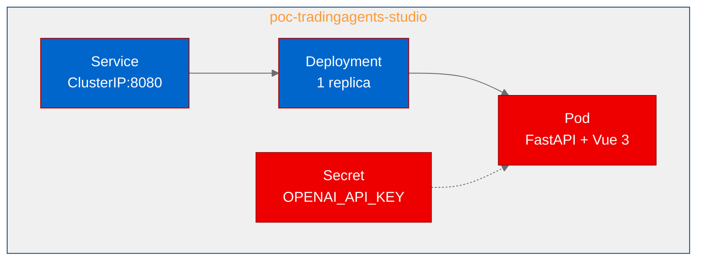

# Deploying a multi-agent LLM trading platform on OpenShift

Multi-agent systems are one of the hottest patterns in AI engineering right now. But most agent frameworks live on developer laptops, running locally with no clear path to production. We wanted to test whether a full-stack multi-agent application could run on OpenShift without significant rearchitecting.

We picked [TradingAgents-Studio](https://github.com/wjhccc/TradingAgents-Studio), a visual multi-agent trading research platform built with LangGraph, FastAPI, and Vue 3. It orchestrates analyst, researcher, and trader agents that debate investment decisions in real time through WebSocket-streamed dialogue. The result: a containerized deployment with all tests passing in under a minute.

## What is TradingAgents-Studio?

TradingAgents-Studio is an Apache-2.0-licensed fork of the TradingAgents framework that adds a web UI on top of the multi-agent engine. It supports multiple LLM providers (OpenAI, Anthropic, Google, DeepSeek, Ollama), covers US and Chinese markets via AKShare and yfinance, and visualizes agent reasoning as causal-chain cards and debate threads rather than walls of text.

The architecture has two main components: a FastAPI backend that runs the LangGraph agent workflow and serves API endpoints, and a Vue 3 frontend that provides the interactive research interface. In production, the backend serves the compiled frontend as static files, making it a single deployable unit.

## Containerizing with UBI images

The existing Dockerfile used `python:3.12-slim`. For OpenShift compatibility, we replaced it with a multi-stage UBI build:

1. **Stage 1**: `registry.access.redhat.com/ubi9/nodejs-22` builds the Vue 3 frontend with Vite
2. **Stage 2**: `registry.access.redhat.com/ubi9/python-312` installs the Python backend and copies the compiled frontend

Two issues surfaced during the build:
- **TypeScript strict mode**: The project's `npm run build` runs `vue-tsc` type checking before Vite bundling. Several type errors blocked the build. We bypassed this by calling `npx vite build` directly, which is standard practice for CI builds where type checking runs separately.
- **File permissions**: OpenShift builds copy source files with restricted ownership. The `chgrp -R 0 /opt/app-root` command needed to run as `USER 0` before switching back to `USER 1001`.

## Deploying to the cluster



The deployment is straightforward: one Deployment, one Service, and one Secret for the LLM API key. We used the `medium` resource profile (1Gi RAM, 500m CPU) since all LLM inference happens via external API calls. No GPU scheduling required.

The readiness probe targets `/api/health`, which FastAPI serves at sub-millisecond latency. The pod reached Ready status within 30 seconds of creation.

## Test results

We validated four scenarios against the running service:

| Test | Result | Latency | What it proves |
|------|--------|---------|---------------|
| Health check (`/api/health`) | Pass | 20ms | Server is up, FastAPI is initialized |
| Root access (`/`) | Pass | 10ms | Vue 3 SPA is served correctly |
| History API (`/api/history`) | Pass | <1ms | SQLite database initialized, API routing works |
| Settings API (`/api/settings`) | Pass | <1ms | Configuration system works, LLM provider settings accessible |

All four tests passed on first attempt with no retries needed.

## What we learned

**Multi-stage UBI builds work well for polyglot apps.** The Node.js-to-Python handoff was clean. The compiled frontend artifacts (`dist/`) copied across stages without issues. This pattern extends to any project that combines a JavaScript frontend with a Python backend.

**OpenShift's random UID assignment is the primary compatibility challenge.** The main friction was file permissions. Setting `chgrp -R 0` and `chmod -R g=u` as root before the final `USER 1001` directive solves it consistently.

**LLM apps are lightweight to host.** Because the LLM inference is offloaded to external APIs, the container itself is CPU-only and modest in resource requirements. The bottleneck shifts from compute to API latency and cost management.

**Agent frameworks with embedded web UIs deploy more naturally than CLI-only tools.** The health check endpoint, structured API responses, and WebSocket support made this application a better fit for Kubernetes than agent frameworks that expect terminal interaction.

## Try it yourself

The deployment artifacts are available in the [autopoc-artifacts branch](https://github.com/aicatalyst-team/TradingAgents-Studio/tree/autopoc-artifacts):
- `Dockerfile.ubi` for the multi-stage UBI build
- `kubernetes/` directory with ready-to-apply manifests
- `poc_test.py` for validation

To deploy on your own cluster:
```bash
git clone https://github.com/aicatalyst-team/TradingAgents-Studio
kubectl apply -f kubernetes/
```

Set your LLM API key in the secret, and you'll have a running multi-agent trading research platform.
