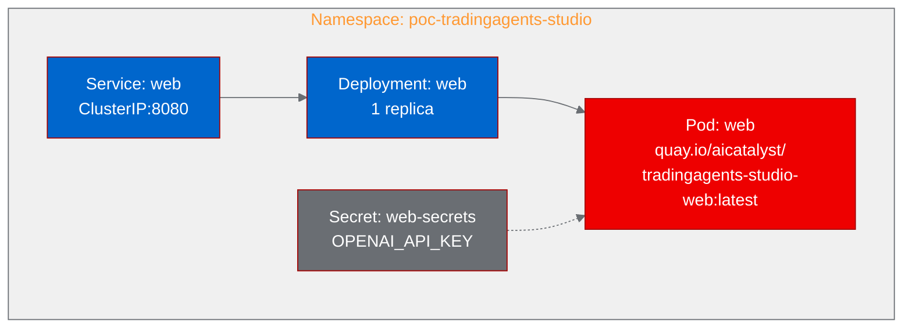

# PoC Report: TradingAgents-Studio

## Executive Summary

TradingAgents-Studio was successfully deployed as a containerized web application on OpenShift. The multi-agent LLM trading research platform, featuring a FastAPI backend and Vue 3 frontend, was containerized using UBI-based multi-stage Docker builds and deployed as a single-pod service. All four validation scenarios passed, confirming that the web UI, API endpoints, and database initialization function correctly in a container environment.

**Result: SUCCESS** - All 4/4 test scenarios passed.

## Project Analysis

| Attribute | Value |
|-----------|-------|
| **Project** | TradingAgents-Studio |
| **Source** | https://github.com/wjhccc/TradingAgents-Studio |
| **Fork** | https://github.com/aicatalyst-team/TradingAgents-Studio |
| **License** | Apache-2.0 |
| **Language** | Python (backend), TypeScript/Vue 3 (frontend) |
| **Category** | LLM Application / Multi-Agent System |
| **Stars** | 42 |

### Components

| Component | Language | Build System | Port | Entry Point |
|-----------|----------|-------------|------|-------------|
| web | Python + Node.js | pip + npm | 8080 | uvicorn web.backend.main:app |

### Key Technologies
- FastAPI (async web framework)
- LangGraph (multi-agent orchestration)
- LangChain (LLM integration: OpenAI, Anthropic, Google, DeepSeek, Ollama)
- Vue 3 + Vite (frontend SPA)
- SQLite (embedded database)
- WebSocket (real-time agent debate streaming)

## PoC Objectives

1. Validate that the FastAPI backend with LangGraph agent orchestration runs reliably in a UBI-based container on OpenShift
2. Confirm the Vue 3 frontend builds and is served correctly through the backend's static file mounting
3. Verify API endpoints are accessible and return valid responses
4. Demonstrate the health check endpoint works for Kubernetes probes

## Pipeline Execution Summary

```mermaid
%%{init: {'theme': 'base', 'themeVariables': {'primaryColor': '#EE0000', 'primaryTextColor': '#fff', 'primaryBorderColor': '#A30000', 'lineColor': '#6A6E73', 'secondaryColor': '#F0F0F0', 'tertiaryColor': '#0066CC'}}}%%
flowchart LR
    A["Phase 1\nIntake"] -->|"completed"| B["Phase 2\nEvaluate"]
    B -->|"completed"| C["Phase 3\nFork"]
    C -->|"completed"| D["Phase 4\nPoC Plan"]
    D -->|"completed"| E["Phase 5\nContainerize"]
    E -->|"completed"| F["Phase 6\nBuild"]
    F -->|"retry x2"| E
    F -->|"completed"| G["Phase 7\nDeploy"]
    G -->|"completed"| H["Phase 8\nApply"]
    H -->|"completed"| I["Phase 9\nTest"]
    I -->|"4/4 pass"| J["Phase 10\nReport"]

    style A fill:#0066CC
    style B fill:#0066CC
    style C fill:#0066CC
    style D fill:#0066CC
    style E fill:#EE0000
    style F fill:#EE0000
    style G fill:#0066CC
    style H fill:#0066CC
    style I fill:#00AA00
    style J fill:#0066CC
```

| Phase | Status | Notes |
|-------|--------|-------|
| 1. Intake | Completed | Single web component identified (FastAPI + Vue 3) |
| 2. Evaluate | Completed | Score: 28.85/40 (impact 13.6, feasibility 15.25) |
| 3. Fork | Completed | Forked to aicatalyst-team/TradingAgents-Studio |
| 4. PoC Plan | Completed | Classified as llm-app, medium resources, 4 test scenarios |
| 5. Containerize | Completed | Multi-stage UBI build (Node.js + Python), 2 retries needed |
| 6. Build | Completed | OpenShift binary build, pushed to quay.io/aicatalyst/tradingagents-studio-web |
| 7. Deploy | Completed | Deployment + Service + Secret manifests generated |
| 8. Apply | Completed | Pod running 1/1 in poc-tradingagents-studio namespace |
| 9. PoC Execute | Completed | 4/4 scenarios passed |
| 10. PoC Report | Completed | This document |

### Build Retries

Two build retries were needed:
1. **Retry 1**: Frontend `vue-tsc` strict type checking failed. Fixed by using `npx vite build` directly.
2. **Retry 2**: `chgrp -R 0` failed because source files had restricted ownership in OpenShift build pods. Fixed by adding `USER 0` before permission operations.

## Test Results

| Scenario | Status | Duration | Output |
|----------|--------|----------|--------|
| health-check | PASS | 0.02s | `{"status":"ok"}` |
| root-access | PASS | 0.01s | Full Vue 3 SPA HTML with TradingAgents-Studio title |
| history-api | PASS | 0.00s | `{"total":0,"page":1,"size":20,"items":[]}` |
| settings-api | PASS | 0.00s | Full configuration JSON with LLM provider settings |

All API responses were correct and returned within millisecond-scale latency.

## Infrastructure Deployed

| Resource | Type | Status |
|----------|------|--------|
| poc-tradingagents-studio | Namespace | Active |
| web | Deployment | 1/1 Ready |
| web | Service | ClusterIP 8080 |
| web-secrets | Secret | OPENAI_API_KEY |

**Resource Allocation**: 500m-1000m CPU, 1Gi-2Gi memory (medium profile)

## Recommendations

### For Production Readiness
1. **External LLM API**: Configure a valid OPENAI_API_KEY or alternative provider to enable full agent analysis functionality
2. **Persistent Storage**: Add a PVC for the SQLite database to persist analysis history across pod restarts
3. **Route/Ingress**: Create an OpenShift Route to expose the web UI externally
4. **WebSocket Support**: Ensure the Route configuration supports WebSocket upgrades for real-time debate streaming

### For OpenShift AI Integration
1. **Model Serving**: Connect to a vLLM or TGI inference endpoint on OpenShift AI instead of external API providers
2. **GPU Scheduling**: Not required for this application (LLM inference is offloaded via API calls)
3. **Multi-tenancy**: The application uses SQLite which is single-instance; consider PostgreSQL for multi-replica scenarios

## ODH/OpenShift AI Considerations

- **Platform Fit**: Demonstrates agentic AI architecture patterns running on OpenShift
- **LLM Flexibility**: Supports multiple LLM providers including Ollama (self-hosted), making it compatible with on-cluster model serving
- **No GPU Required**: All ML inference is via external API calls
- **Container Compatibility**: Successfully runs with OpenShift random UID assignment
- **Health Probes**: `/api/health` endpoint works correctly for Kubernetes readiness/liveness probes

## Appendix

### Artifact Links
- **Fork Repository**: https://github.com/aicatalyst-team/TradingAgents-Studio
- **Container Image**: quay.io/aicatalyst/tradingagents-studio-web:latest
- **PoC Plan**: [autopoc-artifacts branch: poc-plan.md](https://github.com/aicatalyst-team/TradingAgents-Studio/blob/autopoc-artifacts/poc-plan.md)
- **Test Script**: [autopoc-artifacts branch: poc_test.py](https://github.com/aicatalyst-team/TradingAgents-Studio/blob/autopoc-artifacts/poc_test.py)
- **RHOAI Evaluation**: [autopoc-artifacts branch: .autopoc/rhoai-evaluation.md](https://github.com/aicatalyst-team/TradingAgents-Studio/blob/autopoc-artifacts/.autopoc/rhoai-evaluation.md)
- **Kubernetes Manifests**: [main branch: kubernetes/](https://github.com/aicatalyst-team/TradingAgents-Studio/tree/main/kubernetes)
